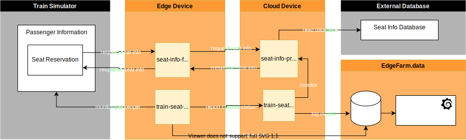

# usecase-2

This use case is located in passenger info section in the simulator. The following figure shows the design of this use case:



The system consists of passenger information system software and its monitoring:
* `passenger information system`:
    * `seat-info-proxy`: (cloud) Read seat reservations from database and provide it to `seat-info-forwarder` on request.
    * `seat-info-forwarder`: (edge) Forward seat-reservation requests from the simulator to the `seat-info-proxy` and return results to the simulator.
* `monitoring`: Monitors the `seat-reservation` process.
    * `fleet-seat-info-monitor`: (cloud) Monitors the `seat-info-proxy` and the `train-seat-info-monitor` of each train and provides the status to ADS.
    * `train-seat-info-monitor`: (edge) Monitors the simulator passenger information system and reports the results to `fleet-seat-info-monitor`.

The data can be viewed in the cloud on a Grafana Dashboard. The idetified events are displayed in a table and the status is shown in a chart. Additional an alarm is set in case an error stays for a dedicated time.

> Note: This setup requires an external database, which is not part of the example. Without this prepared database, this demo won't work.

## Usage

**Pre-Conditions:**
* [The simulator is up and running](../simulator/README.md)
* [EdgeFarm CLI installed](https://github.com/edgefarm/edgefarm-cli/releases)
* [Required EdgeFarm service modules deployed](../base/README.md)

**Deploy use case application:**

`passenger-info.yaml` and `monitoing.yaml` are the deployment manifests of the use case. These contain references to the docker images of demo applications. Modify the docker image's tag for the correct version of the application images.
You can either build your own docker image if you like to modify the demos. For this see the [building section](../README.md#building-yourself) of this Readme.

Apply the application using the edgefarm cli. You must deploy the `basis` and at least one of the application manifests.

```bash
# Note: edgefarm login must be performed prior applying manifests
edgefarm applications apply -f passenger-info.yaml
edgefarm applications apply -f monitoing.yaml
```

Check status of deployment:
```bash
edgefarm applications get deployments -o wide -m
```
